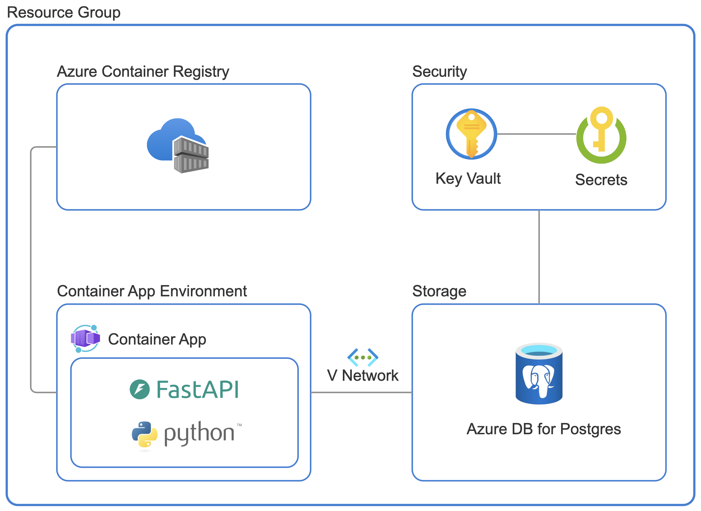
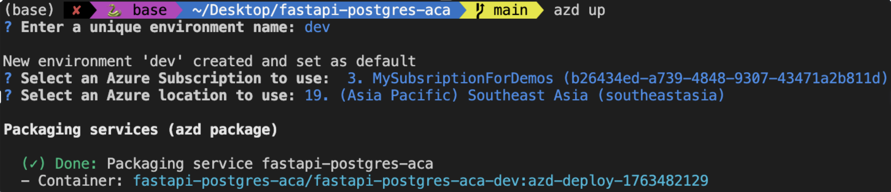
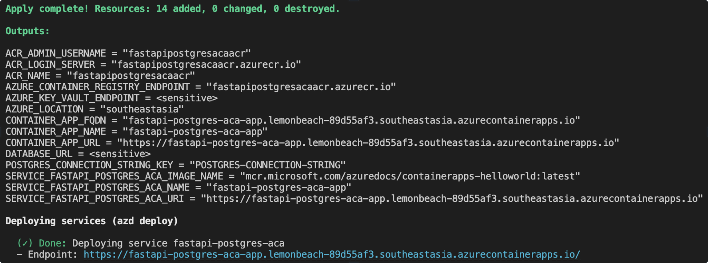
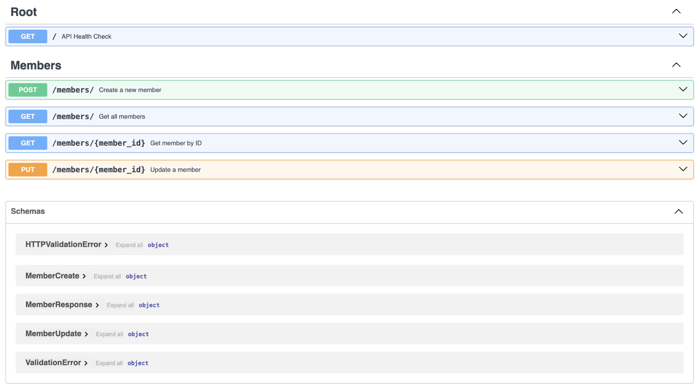

# FastAPI PostgreSQL on Azure Container Apps

A production-ready FastAPI application for membership management, deployed to Azure Container Apps with PostgreSQL database. Features Infrastructure as Code (IaC) with Terraform and streamlined deployment via Azure Developer CLI.

## Features

- **RESTful API**: FastAPI-based membership management system with full CRUD operations
- **Database**: Azure Database for PostgreSQL Flexible Server with SSL support
- **Container Orchestration**: Azure Container Apps with auto-scaling capabilities
- **Secrets Management**: Azure Key Vault for secure credential storage
- **Infrastructure as Code**: Terraform modules for reproducible infrastructure
- **Interactive Documentation**: Auto-generated Swagger UI and ReDoc endpoints
- **Local Development**: Docker Compose setup for offline development

## Architecture



### High-Level Components

1. **Azure Container Apps**: Hosts the FastAPI application with auto-scaling (1-10 replicas)
2. **Azure PostgreSQL Flexible Server**: Managed database with automated backups
3. **Azure Key Vault**: Secure storage for database connection strings
4. **Azure Container Registry**: Private registry for Docker images

### Application Structure

```
src/app/
├── main.py          # FastAPI app with API endpoints
├── database.py      # SQLAlchemy engine with Azure SSL support
├── models.py        # ORM models (Member table)
├── schemas.py       # Pydantic validation schemas
└── crud.py          # Database operations layer

infra/
├── main.tf          # Root Terraform module
└── modules/
    ├── postgres/    # PostgreSQL Flexible Server
    ├── keyvault/    # Key Vault with access policies
    └── containerapp/# Container Apps environment
```

**Architecture Pattern**: Layered architecture with clear separation:
- API Layer ([main.py](src/app/main.py)) → CRUD Layer ([crud.py](src/app/crud.py)) → Data Layer ([models.py](src/app/models.py))

## Prerequisites

> This template will create infrastructure and deploy code to Azure. If you don't have an Azure Subscription, you can sign up for a [free account here](https://azure.microsoft.com/free/). Make sure you have contributor role to the Azure subscription.

### Required Tools

- [Azure Developer CLI](https://aka.ms/azd-install) (v1.5.0+)
- [Python 3.11+](https://www.python.org/downloads/)
- [Terraform CLI](https://aka.ms/azure-dev/terraform-install) (v1.5.0+)
- [Azure CLI](https://learn.microsoft.com/cli/azure/install-azure-cli)
- [Docker](https://docs.docker.com/get-docker/) (optional, for local development)

## Quick Start

### Deploy to Azure

The fastest way to get started is using Azure Developer CLI:

```bash
# Clone the repository
git clone <repository-url>
cd fastapi-postgres-aca

# Login to Azure
azd auth login

# Provision infrastructure and deploy application
azd up
```

This command will:
1. Prompt for environment name, subscription, and Azure region
2. Create all required Azure resources via Terraform
3. Build and push the Docker image to Azure Container Registry
4. Deploy the container to Azure Container Apps



Once complete, you'll see the provisioned resources and the application URL:



### Local Development

```bash
# Navigate to source directory
cd src

# Start application with PostgreSQL database
docker-compose up

# Application runs at http://localhost:8000
# API documentation at http://localhost:8000/docs
```

## API Documentation

The application automatically generates interactive API documentation:

- **Swagger UI**: `http://localhost:8000/docs`
- **ReDoc**: `http://localhost:8000/redoc`



### Available Endpoints

| Method | Endpoint | Description |
|--------|----------|-------------|
| GET | `/` | Health check endpoint |
| POST | `/members/` | Create a new member |
| GET | `/members/` | List all members (supports pagination) |
| GET | `/members/{id}` | Get member by ID |
| PUT | `/members/{id}` | Update member details |

## Destroy Resources

```bash
# Remove all Azure resources
azd down
```

## Contributing

1. Fork the repository
2. Create a feature branch (`git checkout -b feature/amazing-feature`)
3. Commit your changes (`git commit -m 'Add amazing feature'`)
4. Push to the branch (`git push origin feature/amazing-feature`)
5. Open a Pull Request

## Additional Resources

- [FastAPI Documentation](https://fastapi.tiangolo.com/)
- [Azure Container Apps Documentation](https://learn.microsoft.com/azure/container-apps/)
- [Azure PostgreSQL Flexible Server](https://learn.microsoft.com/azure/postgresql/flexible-server/)
- [Terraform Azure Provider](https://registry.terraform.io/providers/hashicorp/azurerm/latest/docs)

## License

This project is licensed under the MIT License - see the LICENSE file for details.

